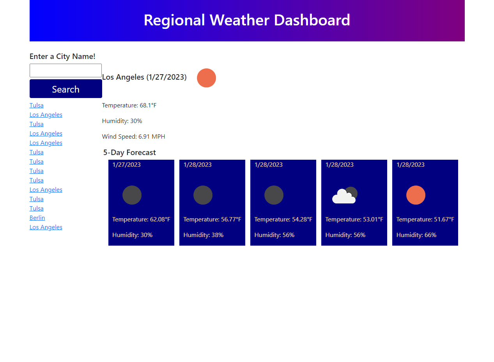

# 06 Server-Side APIs - John Mabie

This is still very much a work in progress!

Failed to realize that I still needed to activate my account by E-mail with the API and as of now my apiKey is still not functionally active, so I wasn't able to do much in the way of testing my code.

This submission is just to avoid the LATE tag on my assignment, but will be updating in the next few days.
Most likely going to schedule a tutoring session or utilize office hours to get everything fully functional.

As of now, site accomplishes next to nothing and since I did all of the HTML through JS, I can't even really see how the formatting looks once the API calls are returned. Hopefully it's nothing too garish by the time the apiKey is activated.

A screenshot of the application when opened in Google Chrome can be seen below:

This screenshot is as of 1/26/2023 at 1:48AM CST, will add updated screenshot(s) once adjustments have been made by way of office hours and tutoring.

A screenshot of the updated application when opened in Google Chrome can be seen below:

This screenshot is as of 1/27/2023 at 3:07PM CST, after utilizing an hour of tutoring. Big improvement, still needs a lot of work with the styling and formatting (and missing Wind Speed for 5-day forecast). Will add updated screenshot(s) once further adjustments have been made.

A link to the deployed application can be found below:
https://jmabie94.github.io/1-25-23-serverAPI-weather-dashboard/